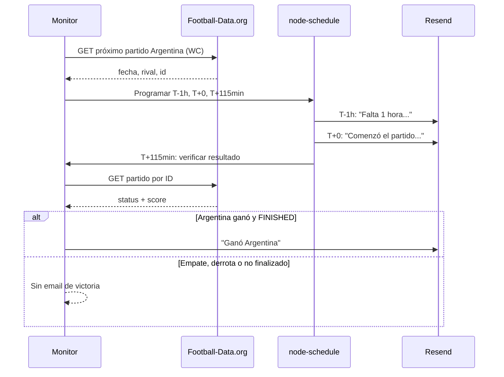

# Monitor de Partidos de Argentina - Mundial 2026

Sistema automatizado en Node.js + TypeScript para monitorear los partidos de Argentina en el Mundial 2026. Consulta la API de [Football-Data.org](https://www.football-data.org/), programa notificaciones por email con [Resend](https://resend.com/) y expone un comando CLI para consultar cuánto falta para el próximo partido.

## Características

- Consulta el próximo partido de Argentina en la competencia del Mundial (`WC`).
- Programa 3 notificaciones por email con el SDK oficial de Resend (`resend`):
  1. **1 hora antes** del inicio → asunto: `Falta 1 hora para el partido de Argentina`
  2. **Al inicio** del partido → asunto: `Comenzó el partido de Argentina`
  3. **~115 minutos después** del inicio → verifica si el partido finalizó y si Argentina ganó → asunto: `Ganó Argentina`
- CLI con `npm run cuantoFalta` para ver el tiempo restante en consola.
- Diseñado para desplegarse en [Render](https://render.com/) como servicio web de larga duración.

## Estructura del proyecto

```
mundial2026/
├── src/
│   ├── index.ts              # Proceso principal (servidor + scheduler)
│   ├── cli.ts                # Comando npm run cuantoFalta
│   ├── config.ts             # Variables de entorno
│   ├── types.ts              # Tipos compartidos
│   ├── apiClient.ts          # Cliente Football-Data.org
│   ├── emailService.ts       # Envío de emails con Resend
│   ├── scheduler.ts            # Lógica de programación de notificaciones
│   ├── schedulerAdapter.ts   # Adaptador node-schedule (testeable)
│   └── utils/
│       └── time.ts           # Cálculos y formateo de tiempo
├── tests/
│   ├── time.spec.ts          # Pruebas de cálculo y formato CLI
│   ├── scheduler.spec.ts     # Pruebas de los 3 eventos de email
│   ├── match-result.spec.ts  # Pruebas de victoria/empate/derrota
│   └── helpers/
│       └── mocks.ts          # Mocks reutilizables
├── .env.example
├── package.json
├── tsconfig.json
└── playwright.config.ts
```

## Requisitos

- Node.js >= 20
- Cuenta en [Football-Data.org](https://www.football-data.org/client/register) (API Key gratuita)
- Cuenta en [Resend](https://resend.com/) con dominio verificado para enviar emails

## Variables de entorno

Copiá `.env.example` a `.env` y completá los valores:

| Variable | Requerida | Descripción |
|----------|-----------|-------------|
| `FOOTBALL_DATA_API_KEY` | Sí | Token de autenticación de Football-Data.org |
| `RESEND_API_KEY` | Sí | API Key de Resend |
| `RESEND_FROM_EMAIL` | Sí | Remitente verificado en Resend (ej: `Argentina Mundial <notif@tudominio.com>`) |
| `NOTIFICATION_EMAIL` | Sí | Email destino de las notificaciones |
| `ARGENTINA_TEAM_ID` | No | ID del equipo Argentina en Football-Data.org (default: `7627`) |
| `WORLD_CUP_COMPETITION_CODE` | No | Código de competencia del Mundial (default: `WC`) |
| `PORT` | No | Puerto del health check HTTP (default: `3000`) |

```bash
cp .env.example .env
```

## Instalación

```bash
npm install
```

## Uso

### Servidor principal (monitor + notificaciones)

Desarrollo:

```bash
npm run dev
```

Producción:

```bash
npm run build
npm start
```

El proceso:
1. Levanta un endpoint de health check en `GET /` (útil para Render).
2. Consulta el próximo partido de Argentina en el Mundial.
3. Programa las 3 tareas de notificación con `node-schedule`.

### CLI: ¿Cuánto falta?

```bash
npm run cuantoFalta
```

Salida esperada:

```
Faltan 3 horas y 30 minutos para que comience el partido entre Argentina y Francia
```

## Despliegue en Render

1. Creá un nuevo **Web Service** en Render conectado a este repositorio.
2. Configurá:
   - **Build Command:** `npm install && npm run build`
   - **Start Command:** `npm start`
3. Agregá las variables de entorno en el panel de Render (las mismas del `.env`).
4. Render asignará automáticamente la variable `PORT`.

> **Nota:** Este servicio debe permanecer en ejecución continua para que `node-schedule` dispare las notificaciones en el momento exacto. Un plan gratuito puede entrar en sleep; para notificaciones puntuales se recomienda un plan que no suspenda el proceso.

## Tests

Las pruebas usan [Playwright Test](https://playwright.dev/docs/test-intro) orientado a lógica de API (sin navegador):

```bash
npm test
```

Cobertura de pruebas:
- Cálculo de tiempo restante y formato exacto del CLI.
- Programación y ejecución de las 3 notificaciones (con API mockeada).
- Envío condicional del email de victoria (gana / empata / pierde / partido no finalizado).

## Flujo de notificaciones



## Licencia

MIT
